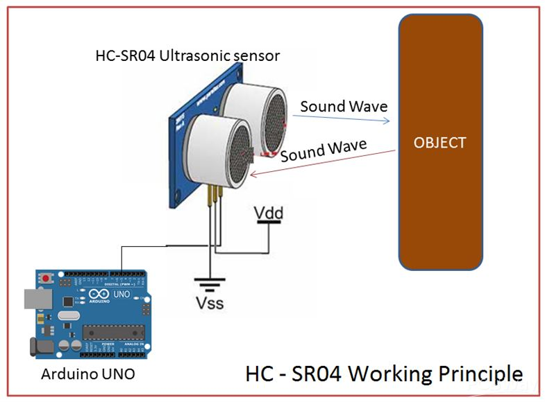

# My_CircuitPython_Assignments

### This is my adventure with the first time using CircuitPython, and Coding with the Python Language.

## TableofContents
* [SteadyRed LED](#FirstAssignment)
* [Servo with Capacitive Touch](#SecondAssignment)
* [LCD with Cap. Touch](#ThirdAssignment)
* [Photo Interrupter](#FourthAssignment)
* [Distance Sensor](#FifthAssignment)
---

# FirstAssignment 
## - Get RGB LED working

## Description
The goal of this assignment was to get the board up and running, and to get the onboard RGB to hold a steady, red color. We had to use libraries, which we imported through the [Python help site](https://circuitpython.org/board/metro_m0_express/).

## [Code](https://github.com/willhk10/Circuitpython3/blob/main/Files/SteadyRed.py)

```python
import board
import neopixel

dot = neopixel.NeoPixel(board.NEOPIXEL, 1)

print("Make it red!")

while True:
     dot.fill((255,0,0))
```

## Problemos
First of all, I had to download [Mu](https://codewith.mu/en/downloadOne). This was fairly self explanatory, as you click the link and then whichever software you have will pertain to the download you need to get. The only real problem that I was continuously having was that the library "Neopixel" was not being recognized by my MetroM0. In order to fix this problem, I had to go to a [website](https://circuitpython.org/libraries) and download the libraries there. I downloaded v5 so that I got all the new ones.

After this, it worked like a charm!
 


-----

# SecondAssignment 
## - Servo Capacitive Touch

## Description
This assignment was to use a continuous servo and the MetroExpress Capacitive Touch feature. The goal of the assignment was to use two wires and have the servo move forwards and backwards by touching each wire.

## [Code](https://github.com/willhk10/Circuitpython3/blob/main/Files/ServoCapacitiveTouch.py)

## Important snippets of code and what they mean
```python
import touchio
```
#### Importance -
This allows for the code that you write to incorporate capacitive touch.
---
```python
min_val = 0
max_val = 180
val = myServo.angle
myServo.angle = 5


def constrain(val, min_val, max_val):

    if val < min_val:
        return min_val
    if val > max_val:
        return max_val
    return val
```
### Importance -
Prevents error messages if the value being sent to the servo exceeds the mins or maxes that the servo can understand
---
```python
while True:
    if touch_A0.value:
        print("Forward! ; " , myServo.angle) #Allows me to see which wire is being touched in the Serial Monitor, and what the value is..
        myServo.angle = constrain((myServo.angle +4), min_val , max_val) # Moves it to 180
        time.sleep(0.1)
    if touch_A1.value:
        print("Backward! ; " , myServo.angle)#Allows me to see which wire is being touched in the Serial Monitor, and what the value is.
        myServo.angle = constrain((myServo.angle -4), min_val , max_val) #Moves it to 0
        time.sleep(0.1)
```
### Importance - 
This makes the servo move back and forth, and prints the value that the servo is processing to the serial monitor for debugging.
---
## Pictures 


                                                        
---


---
## Problemos
There weren't all that many problems, but I did have to figure out how to use the [Constrain feature](https://stackoverflow.com/questions/34837677/a-pythonic-way-to-write-a-constrain-function/34837691) that I copied from the website hyperlinked. The constrain feature didn't work initially, because I didn't actually incorporate it into the code. After putting the constrain feature right, the code I included above worked perfectly. You can adjust the speed of the servo arm by increasing the additions and subtractions to the x value 


# ThirdAssignment
## LCD with CircuitPython

## Description
The goal of this assignment was to use capacitive touch to get a number on an LCD screen count up by one every time one wire is touched, and count down by one when the other one is touched

## [Code](https://github.com/willhk10/Circuitpython3/blob/main/Files/LCDDisplayCounter.py)
### Important snippets from the code and what they mean
```python
from lcd.lcd import LCD
from lcd.i2c_pcf8574_interface import I2CPCF8574Interface
```
Pulls the LCD library from a folder inside of the MetroM0 Express. This allows the Metrom0 to cimmunicate with the LCD screen

```python
while True:
    if touch_A0.value:
        lcd.clear()
        x = x + 1
        lcd.print(str(x))
        while touch_A0.value:
            print("HelloA0")
    if touch_A1.value:
        lcd.clear()
        x = x - 1
        lcd.print(str(x))
        while touch_A1.value:
            print("HelloA1")
```
This adds one to the counter on screen when Wire A0 is touched, and subtracts one number when wire A1 is touched

## Problems
 There were no actual problems that I had when working through this assignment. I did not have to constrain anything, and the only thing that i had to learn how to do was print the numbers to the LCD screen, which i learned how to do [here](https://learn.adafruit.com/character-lcds/python-circuitpython)
I also found how to wire the device at this link as well.
## Takeaway
In the end, I learned how to control the LCD Screen.

---

# FourthAssignment
## Photointerrupter Printing


## Description


## [Code](https://github.com/willhk10/Circuitpython3/blob/main/Files/Photointerrupter.py)


## Problems


## Takeaway

---

# FifthAssignment

## Distance Sensor

## Description
The main goal of this project is to learn how to work with the HCSRO4 Distance Sensing module. The HCSRO4 Module works by sending ultrasonic waves in a cone around the module,  which reflect back to the module off the object. The time it takes for the waves to come back to the object will determine the distance from module to object. Although this assignment seems to just be about learning how to use the HC-SRO4, you must also learn the information you learned from working with the Neopixel Library to change an RGB LED based on the distance readings from the module.

Here is an example:


## [Code](https://github.com/willhk10/Circuitpython3/blob/main/Files/DistanceSensor.py)

## Problems
I did not run into any problems because I have used this code before while working with the CircuitPython MetroM0 express Board in the summer, and I have been working with RBG LED's for a long time.

## Takeaway
The main takeaway of this project was that I learned how to program the HC-SRO4 with Circuitpython, and I learned how to incorporate outputs from the distance sensing module into another part of my code. This opened up a new path of coding for me, where I can use inputs and ouputs from various modules to send signals and activate other modules.

[BACK TO TOP](#My_CircuitPython_Assignments)
